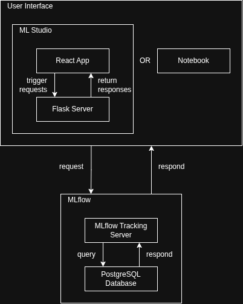
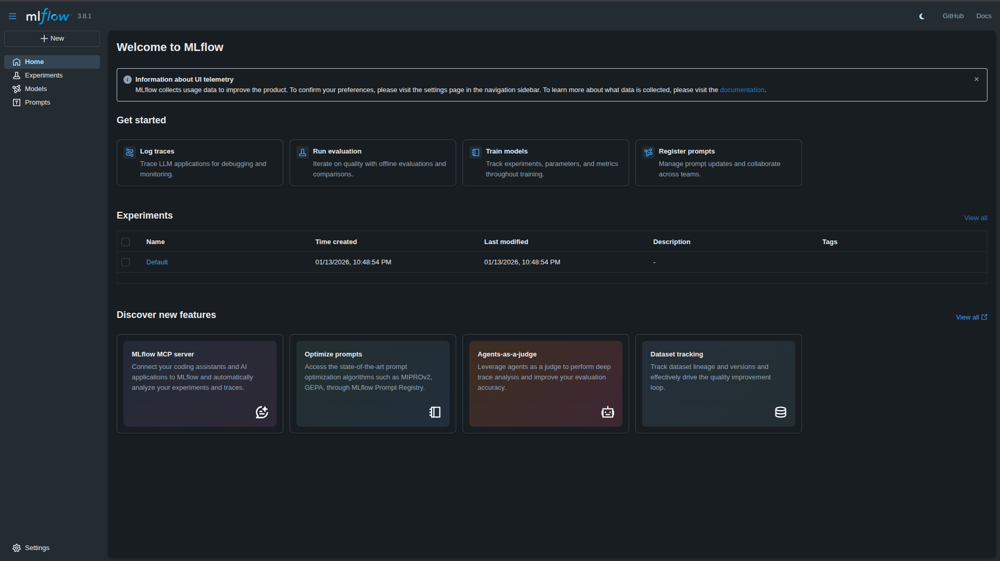

# ML Studio

- [ML Studio](#ml-studio)
  - [Project Overview](#project-overview)
  - [Architecture Diagram](#architecture-diagram)
  - [Prerequisites](#prerequisites)
    - [System Requirements](#system-requirements)
    - [Connectivity](#connectivity)
  - [Getting Started (Docker)](#getting-started-docker)
    - [1. Build and Deploy](#1-build-and-deploy)
    - [2. Service Verification](#2-service-verification)
      - [**A. MySQL Database (Auth)**](#a-mysql-database-auth)
      - [**B. Cerberus API (Port 5000)**](#b-cerberus-api-port-5000)
      - [**C. PostgreSQL Database (MLflow Metadata)**](#c-postgresql-database-mlflow-metadata)
      - [**D. MLflow UI (Port 5050)**](#d-mlflow-ui-port-5050)
      - [**E. ML Studio Backend (Port 5001)**](#e-ml-studio-backend-port-5001)
      - [**F. ML Studio UI (Port 3000)**](#f-ml-studio-ui-port-3000)
    - [3. Shutdown and Cleanup](#3-shutdown-and-cleanup)
  - [Project Structure](#project-structure)
    - [Notable Files](#notable-files)
  - [API Documentation](#api-documentation)
    - [**Experiments**](#experiments)
    - [**Runs**](#runs)
    - [**Model Registry**](#model-registry)
    - [**Model Versions**](#model-versions)
    - [**Artifacts**](#artifacts)
    - [**Error Responses**](#error-responses)
  - [MLflow Integration](#mlflow-integration)
  - [Development \& Testing](#development--testing)
  - [Known Issues \& Troubleshooting](#known-issues--troubleshooting)
  - [Roadmap / Future Enhancements](#roadmap--future-enhancements)
  - [License](#license)

## Project Overview

**ML Studio** is an enterprise-grade machine learning module integrated into the <a href="https://blendata.com/product/blendata-enterprise/">**Blendata Enterprise**</a> big data platform. While it leverages **MLflow** to handle the core machine learning lifecycle, it is specifically designed to overcome the limitations MLflow faces in large-scale organizational environments.

The project focuses on three key enhancements:

* **User Access Control (UAC):** Implementing a custom API layer to bridge Blendata’s enterprise security with MLflow, enabling robust multi-project permission management.
* **Bespoke User Interface:** Replacing the standard MLflow UI with a custom-built frontend to ensure visual consistency, improved user satisfaction, and seamless platform integration.
* **Standardized Operations:** Establishing "default" architectural and security protocols to automate server configuration, logging, and reliability, thereby reducing the risk of miscommunication and technical debt.

Ultimately, ML Studio transforms an open-source tool into a secure, consistent, and scalable platform for professional data science teams.

## Architecture Diagram



According to the architecture diagram, there are 3 applications running in ML Studio system:

- **ML Studio application:** having React application as the frontend interacting Flask server as the backend
- **Cerberus application:** having Flask server as the source of APIs accessing MySQL database
- **MLflow application:** having MLflow tracking server as the source of APIs accessing PostgreSQL database

Users can interact with ML Studio via either ML Studio application or notebooks. Each user interface can interact with Cerberus to operate some process related to user access control. Besides, both user interfaces are connected to MLflow application to access some assets in MLflow.

## Prerequisites

To ensure this project remains platform-independent and portable, all dependencies (Python libraries, Node modules, and system packages) are managed within Docker containers. The only requirements for the host machine are:

* **Docker:** Version 20.10.0 or higher.
* **Docker Compose:** Version 2.0.0 or higher (now included by default with Docker Desktop).

### System Requirements

* **Operating System:** Linux (Recommended: Nobara/Fedora/Ubuntu), macOS, or Windows 10/11 (with WSL2 enabled).
* **Hardware:** 
  * Minimum **8GB RAM** (To support simultaneous execution of MySQL, PostgreSQL, MLflow, two Flask backends, and a React development server).
  * Minimum **5GB Disk Space** (For base images and persistent database volumes).

### Connectivity

* **Internet Access:** Required for the initial build to pull base images (`python:3.11-slim`, `node:18-alpine`, `mysql:8.0`, `postgres:15`) and install dependencies via `pip` and `npm`.
* **Port Availability:** Ensure the following ports are not being used by other local services:
* `3000` (ML Studio web module)
* `5000` (Cerberus API server)
* `5001` (ML Studio backend server)
* `5050` (MLflow UI)
* `3306` (MySQL)
* `5432` (PostgreSQL)

## Getting Started (Docker)

Follow these steps to build, deploy, and verify the ML Studio ecosystem. Ensure your Docker engine is running before starting.

### 1. Build and Deploy

Execute the following command to build the custom images for the Python backends and React frontend, and start all services in detached mode:

```bash
docker compose up --build -d

```

---

### 2. Service Verification

To ensure each module is functioning correctly, perform the following health checks:

#### **A. MySQL Database (Auth)**

Verify that the RBAC schema is correctly initialized:

```bash
docker compose exec db mysql -u blendata -p'#########' auth

```

Inside the MySQL shell, run `SHOW TABLES;`. You should see the following output:

```text
+-----------------+
| Tables_in_auth  |
+-----------------+
| component       |
| element         |
| operation       |
| permission      |
| user            |
| user_permission |
+-----------------+

```

#### **B. Cerberus API (Port 5000)**

Test the primary authentication and permission backend:

```bash
curl localhost:5000

```

**Success Output:** `Connected to database: auth`

#### **C. PostgreSQL Database (MLflow Metadata)**

Verify the metadata store for MLflow:

```bash
docker exec -it ml-studio-sim-pg-db-1 psql --user=blendata --dbname=mlflow

```

Inside the psql shell, run `\d` to list the internal MLflow tracking tables.

#### **D. MLflow UI (Port 5050)**

Access the experiment tracking dashboard by navigating to:
**URL:** `http://localhost:5050`

The resulting webpage should look like this:



#### **E. ML Studio Backend (Port 5001)**

Verify the standalone ML Studio service:

```bash
curl localhost:5001

```

**Expected Response:** `{"message":"Welcome to ML Studio","service":"ml_studio","status":"Online"}`

#### **F. ML Studio UI (Port 3000)**

Access the custom React dashboard by navigating to:
**URL:** `http://localhost:3000`

The resulting webpage should look like this:


---

### 3. Shutdown and Cleanup

To stop the services while keeping your database data intact:

```bash
docker compose down

```

To perform a "Nuclear Reset" (deleting all containers, networks, and persistent data volumes), use the volume flag:

```bash
docker compose down -v

```

> **Note:** Use the `-v` flag with caution as it will permanently delete your MLflow experiment history and MySQL user data.

## Project Structure

```
└── 📁ml-studio
    └── 📁app
        └── 📁cerberus
            ├── main.py
            ├── requirements.txt
        └── 📁ml_studio
            ├── functions.py
            ├── main.py
            ├── requirements.txt
        └── 📁mlflow
            ├── requirements.txt
        └── 📁ui
            └── 📁public
                ├── index.html
            └── 📁src
                ├── App.js
                ├── index.js
            ├── Dockerfile
            ├── package.json
        └── 📁zeppelin
            ├── test.ipynb
        ├── base_requirements.txt
    └── 📁images
        ├── architecture.png
        ├── ml-studio-ui.png
        ├── mlflow-ui.png
    ├── .gitignore
    ├── docker-compose.yml
    ├── Dockerfile
    ├── Makefile
    ├── README.md
    └── test-note.txt
```

Focusing on `app` as the main directory, we can see 5 sub-directories representing key servers of ML Studio:

- `cerberus`: has `main.py` as the main Python program running a Flask application.
- `ml_studio`: consists of
  - `main.py` as the main Python program running a Flask application
  - `function.py` to store key MLflow functions
- `mlflow`: doesn't rely on any program at the moment as it's a complete package since installation.
- `ui`: acts as the main directory of a React project responsible for ML Studio's UI.
- `zeppelin`: stores notebooks that calls MLflow. In this version, it's actually not a server but created to simulate a real Apache Zeppelin server.

### Notable Files

- `base_requirements.txt`: lists Python libraries commonly used across different servers (such as Flask).
- `docker-compose.yml`: lists Docker container compositions and their configurations.
- `Dockerfile`: orders commands used for container setup.
- `Makefile`: shortcuts frequently used commands to facilitate operation and testing process.

## API Documentation

ML Studio provides a RESTful API layer that acts as a bridge between the frontend and the MLflow Tracking Server. This documentation outlines the available endpoints for managing experiments, runs, models, and artifacts.

### **Experiments**

| Endpoint | Method | Parameters (JSON / Query) | Description |
| --- | --- | --- | --- |
| `/api/experiments/create` | `POST` | `name` (req), `artifact_location`, `tags` | Creates a new MLflow experiment. |
| `/api/experiments/search` | `POST` | `max_results`, `filter`, `view_type`, `order_by` | Searches for experiments matching specific criteria. |
| `/api/experiments/get` | `GET` | `experiment_id` (req) | Retrieves metadata for a specific experiment. |
| `/api/experiments/get-by-name` | `GET` | `experiment_name` (req) | Retrieves experiment metadata using its unique name. |
| `/api/experiments/update` | `POST` | `experiment_id` (req), `new_name` (req) | Renames an existing experiment. |
| `/api/experiments/delete` | `POST` | `experiment_id` (req) | Marks an experiment for deletion. |
| `/api/experiments/restore` | `POST` | `experiment_id` (req) | Restores an experiment marked for deletion. |

---

### **Runs**

| Endpoint | Method | Parameters (JSON / Query) | Description |
| --- | --- | --- | --- |
| `/api/runs/search` | `POST` | `experiment_ids` (req), `filter`, `max_results` | Searches for runs within specific experiments. |
| `/api/runs/get` | `GET` | `run_id` (req) | Retrieves detailed metadata and data for a specific run. |
| `/api/runs/update` | `POST` | `run_id` (req), `status`, `run_name` | Updates the status or name of a specific run. |
| `/api/runs/delete` | `POST` | `run_id` (req) | Deletes a specific run. |
| `/api/metrics/get-history` | `GET` | `run_id` (req), `metric_key` (req) | Retrieves the full history of a specific metric for a run. |

---

### **Model Registry**

| Endpoint | Method | Parameters (JSON / Query) | Description |
| --- | --- | --- | --- |
| `/api/models/create` | `POST` | `name` (req), `tags`, `description` | Registers a new model in the Model Registry. |
| `/api/models/get` | `GET` | `name` (req) | Retrieves metadata for a registered model. |
| `/api/models/rename` | `POST` | `name` (req), `new_name` (req) | Changes the name of a registered model. |
| `/api/models/delete` | `DELETE` | `name` (req) | Deletes a registered model and all its versions. |

---

### **Model Versions**

| Endpoint | Method | Parameters (JSON / Query) | Description |
| --- | --- | --- | --- |
| `/api/model-versions/create` | `POST` | `name` (req), `source` (req), `run_id` | Creates a new version for a registered model. |
| `/api/model-versions/transition-stage` | `POST` | `name` (req), `version` (req), `stage` (req) | Transitions a model version to a new stage (e.g., Staging, Production). |

---

### **Artifacts**

| Endpoint | Method | Parameters (JSON / Query) | Description |
| --- | --- | --- | --- |
| `/api/artifacts/list` | `GET` | `run_id` (req), `path` | Lists the artifacts stored for a specific run at the given path. |

---

### **Error Responses**

All endpoints return a **400 Bad Request** status if a required parameter is missing, with a JSON body:

```json
{
  "error": "'parameter_name' is required"
}

```

Internal server errors or MLflow communication issues return a **500 Internal Server Error**.

## MLflow Integration

[Explain how to access the MLflow UI, where artifacts are stored, and how to point external scripts to the tracking server.]

---

## Development & Testing

[Outline how to run tests for individual services and how to use the provided Makefile for common tasks.]

## Known Issues & Troubleshooting

[Document common hurdles, such as the "Orphan Container" problem during branch switches or CORS issues between the frontend and backend.]

---

## Roadmap / Future Enhancements

[List upcoming features, such as adding Nginx as a Reverse Proxy or implementing the Causal AI learning roadmap.]

## License

[Specify the license type (e.g., MIT, Apache 2.0).]